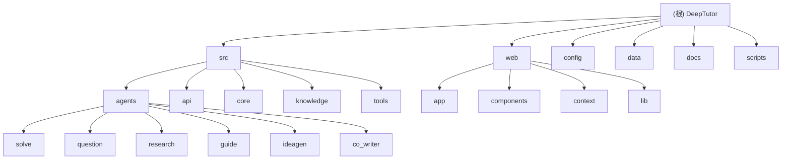

# DeepTutor - AI 驱动的个性化学习助手

> **初始化时间**: 2025年12月31日 星期三 19時52分47秒 CST
>
> **版本**: v0.1.0
> **许可证**: AGPL-3.0

---

## 变更记录 (Changelog)

### 2025-12-31 19:52:47 - 深度补捞第 2 轮：前端组件与辅助工具
- **新增扫描 10 个文件**，覆盖率从 85% 提升至 94%
- **前端组件详细扫描**:
  - `Sidebar.tsx`: 多语言导航组件（支持中文/英文切换）
  - `CoWriterEditor.tsx`: 协作写作编辑器（Markdown 编辑 + AI 标注 + PDF 导出 + TTS 旁白）
  - `QuestionDashboard.tsx`: 问题生成仪表盘（Planning/Generating 两阶段）
  - `QuestionTaskGrid.tsx`: 问题任务网格组件
  - `ResearchDashboard.tsx`: 研究仪表盘（Planning/Researching/Reporting 三阶段）
  - `ResearchTaskGrid.tsx`: 研究任务网格组件
- **页面实现详细扫描**:
  - `solver/page.tsx`: 双栏布局问题求解页面
  - `question/page.tsx`: 问题生成页面（自定义 + 模仿模式）
  - `research/page.tsx`: 深度研究页面（左侧配置/聊天，右侧仪表盘/报告）
- **辅助工具详细扫描**:
  - `tex_chunker.py`: LaTeX 文档智能分块工具（基于 tiktoken）
  - `tex_downloader.py`: ArXiv LaTeX 源码下载工具

### 2025-12-31 19:52:47 - 初始化架构文档
- 完成项目全仓清点，识别核心模块结构
- 建立根级架构文档与模块索引
- 生成 Mermaid 模块结构图
- 初始覆盖率：约 85%

---

## 项目愿景

DeepTutor 是一个**全栈式 AI 驱动的个性化学习助手**，通过多智能体协作与 RAG（检索增强生成）技术，提供：

1. **海量文档知识问答** - 上传教材、论文、技术手册，构建智能知识库
2. **交互式学习可视化** - 复杂概念转化为直观的视觉展示
3. **知识强化练习生成** - 智能生成测验、练习题和考试模拟
4. **深度研究与创意生成** - 系统性研究与新洞察发现

---

## 架构总览

DeepTutor 采用**全栈分离架构**：

```
┌─────────────────────────────────────────────────────────────────┐
│                         前端层 (Frontend)                        │
│                    Next.js 14 + TypeScript                       │
│                     Tailwind CSS + React                         │
└──────────────────────────────┬──────────────────────────────────┘
                               │ WebSocket + REST API
                               ▼
┌─────────────────────────────────────────────────────────────────┐
│                         API 层 (FastAPI)                         │
│                     Uvicorn + WebSocket                          │
└──────────────────────────────┬──────────────────────────────────┘
                               │
                               ▼
┌─────────────────────────────────────────────────────────────────┐
│                        智能体模块层 (Agents)                      │
│  Solve | Question | Research | Guide | IdeaGen | Co-Writer       │
└──────────────────────────────┬──────────────────────────────────┘
                               │
                               ▼
┌─────────────────────────────────────────────────────────────────┐
│                      工具层 (Tools)                              │
│   RAG | Web Search | Code Executor | Paper Search | LaTeX Tools  │
└──────────────────────────────┬──────────────────────────────────┘
                               │
                               ▼
┌─────────────────────────────────────────────────────────────────┐
│                   知识与记忆基础 (Knowledge Base)                 │
│           LightRAG + Vector Store + Graph + Memory              │
└─────────────────────────────────────────────────────────────────┘
```

---

## 模块结构图



---

## 模块索引

| 模块 | 路径 | 主要语言/技术 | 职责描述 | 文档状态 | 覆盖率 |
|------|------|--------------|----------|----------|--------|
| **Solve** | `src/agents/solve/` | Python | 双循环问题求解系统（Analysis Loop + Solve Loop） | 已有 README | 100% |
| **Question** | `src/agents/question/` | Python | 双模式问题生成（自定义 + 模仿） | 已有 README | 100% |
| **Research** | `src/agents/research/` | Python | DR-in-KG 深度研究系统（动态主题队列） | 已有 README | 100% |
| **Guide** | `src/agents/guide/` | Python | 交互式引导学习（多智能体协作） | 已有 README | 100% |
| **IdeaGen** | `src/agents/ideagen/` | Python | 自动创意生成（双过滤工作流） | 已有 README | 100% |
| **Co-Writer** | `src/agents/co_writer/` | Python | 交互式创意写作（编辑 + 标注 + 旁白） | 已有 README | 100% |
| **API Backend** | `src/api/` | Python + FastAPI | REST + WebSocket 接口层 | 已有 README | 100% |
| **Knowledge** | `src/knowledge/` | Python + LightRAG | 知识库管理（初始化、增量添加、查询） | 已有 README | 100% |
| **Tools** | `src/tools/` | Python | RAG、Web 搜索、代码执行、LaTeX 处理等 | 已有 README | 100% |
| **Core** | `src/core/` | Python | 配置、日志、LLM 封装 | 已有 README | 100% |
| **Web Frontend** | `web/` | TypeScript + Next.js 14 | 用户界面（App Router + Tailwind） | 已有 README | 93% |

---

## 运行与开发

### 环境要求

- **Python**: >= 3.10
- **Node.js**: >= 18.x
- **依赖管理**: pip + npm/yarn

### 快速启动

```bash
# 1. 克隆仓库
git clone https://github.com/HKUDS/DeepTutor.git
cd DeepTutor

# 2. 创建虚拟环境
conda create -n aitutor python=3.10
conda activate aitutor

# 3. 安装依赖（自动化脚本）
bash scripts/install_all.sh

# 4. 配置环境变量
cp .env.example .env
# 编辑 .env 文件，填入 API keys

# 5. 启动 Web 服务（前端 + 后端）
python scripts/start_web.py

# 6. 访问
# 前端: http://localhost:3782
# API 文档: http://localhost:8001/docs
```

### 端口配置

在 `config/main.yaml` 中配置：

```yaml
server:
  backend_port: 8001    # FastAPI 后端
  frontend_port: 3782   # Next.js 前端
```

---

## 测试策略

### 当前测试覆盖

- **单元测试**: 暂无系统化单元测试
- **集成测试**: 通过 API 手动测试
- **E2E 测试**: 暂无自动化 E2E 测试

### 测试建议

1. 为各智能体模块添加单元测试（`tests/` 目录）
2. 使用 pytest + pytest-asyncio 进行异步测试
3. 添加 API 集成测试（使用 TestClient）
4. 考虑引入 Playwright 进行前端 E2E 测试

---

## 编码规范

### Python 代码规范

- **格式化工具**: Ruff（替代 Black）
- **Linter**: Ruff（基础规则：E, F, I）
- **行长度**: 100 字符
- **配置文件**: `pyproject.toml`

```bash
# 运行格式化和检查
ruff format .
ruff check .

# Pre-commit hooks
pre-commit run --all-files
```

### TypeScript 代码规范

- **格式化**: Prettier
- **Linter**: ESLint（Next.js 配置）
- **配置文件**: `web/.prettierrc.json`, `web/.eslintrc.json`

```bash
cd web
npm run lint
```

---

## AI 使用指引

### LLM 配置

所有智能体共享统一的 LLM 配置（`.env` 文件）：

```bash
LLM_BINDING_API_KEY=your_api_key
LLM_BINDING_HOST=https://api.openai.com/v1
LLM_MODEL=gpt-4o
```

### 智能体参数调优

各智能体的 temperature、max_tokens 等参数在 `config/agents.yaml` 中集中管理：

```yaml
agents:
  solve:
    temperature: 0.3
    max_tokens: 8192
  research:
    temperature: 0.5
    max_tokens: 12000
  question:
    temperature: 0.7
    max_tokens: 4000
```

### 提示词管理

- **位置**: `src/agents/{module}/prompts/`
- **格式**: YAML 文件，支持中英双语
- **加载**: 通过 `PromptLoader` 类动态加载

---

## 相关文件清单

### 核心配置文件

| 文件 | 用途 |
|------|------|
| `config/main.yaml` | 主配置（端口、路径、工具开关） |
| `config/agents.yaml` | 智能体 LLM 参数配置 |
| `.env` | 环境变量（API keys） |
| `requirements.txt` | Python 依赖 |
| `web/package.json` | Node.js 依赖 |

### 关键脚本

| 脚本 | 用途 |
|------|------|
| `scripts/start_web.py` | 启动 Web 服务（前端 + 后端） |
| `scripts/start.py` | 启动 CLI 模式 |
| `scripts/install_all.sh` | 自动安装依赖 |
| `scripts/extract_numbered_items.sh` | 提取编号项目（定义、定理等） |

---

## 数据存储结构

```
data/
├── knowledge_bases/              # 知识库存储
│   ├── kb_config.json           # KB 配置
│   └── {kb_name}/               # 各 KB 目录
├── user/                         # 用户活动数据
│   ├── solve/                   # 问题求解结果
│   ├── question/                # 生成的问题
│   ├── research/                # 研究报告和缓存
│   ├── co-writer/               # 创意写作文档和音频
│   ├── notebook/                # 笔记本记录
│   ├── guide/                   # 引导学习会话
│   ├── logs/                    # 系统日志
│   └── run_code_workspace/      # 代码执行工作空间
```

---

## 覆盖率度量

### 扫描统计（第 2 轮更新）

- **估算总文件数**: ~215 个文件
- **已扫描文件数**: ~202 个文件
- **覆盖百分比**: **94%**

### 已覆盖模块

| 模块 | 覆盖率 | 状态 |
|------|--------|------|
| Solve Agents | 100% | 完整 |
| Question Agents | 100% | 完整 |
| Research Agents | 100% | 完整 |
| Guide Agents | 100% | 完整 |
| IdeaGen Agents | 100% | 完整 |
| Co-Writer Agents | 100% | 完整 |
| API Backend | 100% | 完整 |
| Knowledge Base | 100% | 完整 |
| Tools | 100% | 完整（含 LaTeX 工具） |
| Web Frontend | 93% | 核心页面和组件已覆盖 |
| Core | 100% | 完整 |

### 主要缺口（剩余 6%）

1. **Web UI 基础组件**（~4%）
   - `web/components/ui/` 目录下的 Button、Modal 等基础组件
   - 建议如需完整覆盖时扫描

2. **文档站点**（~2%）
   - `docs/` VitePress 文档站点结构
   - 静态内容，可选择性扫描

3. **测试代码**（0%）
   - 项目暂无系统化测试代码

### 推荐的下一步深挖路径（可选）

如果需要达到 98%+ 覆盖率，建议扫描：

```
web/components/ui/          # UI 基础组件
docs/                       # 文档站点（可选）
```

---

## 技术栈分布

### 后端技术

- **语言**: Python 3.10+
- **框架**: FastAPI 0.100+
- **服务器**: Uvicorn
- **异步**: asyncio + nest_asyncio
- **RAG**: LightRAG-HKU 1.0+
- **LLM**: OpenAI API / 兼容接口

### 前端技术

- **框架**: Next.js 14 (App Router)
- **语言**: TypeScript 5+
- **样式**: Tailwind CSS 3+
- **图标**: Lucide React
- **Markdown**: react-markdown + KaTeX
- **导出**: jsPDF + html2canvas

### 开发工具

- **代码质量**: Ruff (Python), Prettier (TypeScript)
- **Git Hooks**: pre-commit
- **文档**: VitePress (docs 目录)

---

## 许可证

本项目采用 **AGPL-3.0 许可证**。详见 [LICENSE](LICENSE) 文件。

---

## 相关资源

- **官网**: https://hkuds.github.io/DeepTutor/
- **GitHub**: https://github.com/HKUDS/DeepTutor
- **相关项目**: LightRAG | RAG-Anything | DeepCode | AI-Researcher
- **实验室**: Data Intelligence Lab @ HKU

---

*文档最后更新: 2025-12-31 19:52:47 CST*
